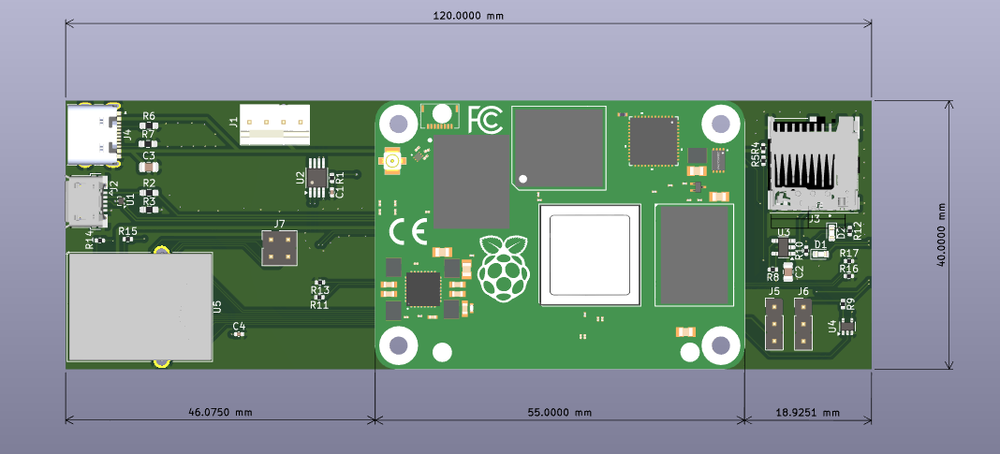

# **RapidAnalysis CM4 Blade Carrier Board** 

### **Features** 

The Carrier Board includes:
1. Hirose CM4 Rails
2. Ethernet
3. USB-Micro (Data Transfer)
4. USB-C (Power)
5. SD-Card
6. Fan Connector
7. Boot Jumper

### **Dimensions**

