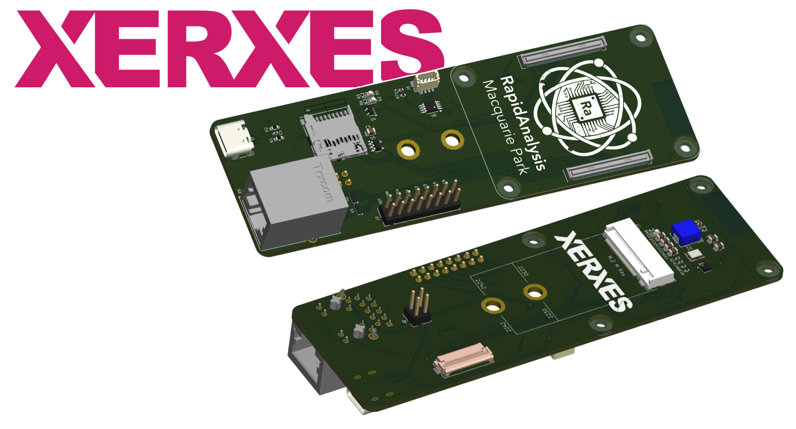

# **RapidAnalysis Xerxes Pi** 

### **Features** 

The Carrier Board includes:
1. Amphenol CM5 Rails
2. Ethernet (with 4-Pin POE and ESD Protection)
3. USB-C OTG
4. SD-Card
5. M.2 M Key Connector and Power Supply Unit
6. CSI Connector
7. Fan header
8. Boot & Miscellaneous Jumpers
